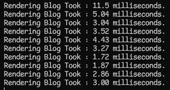
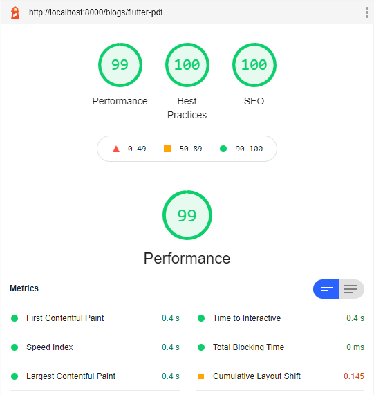
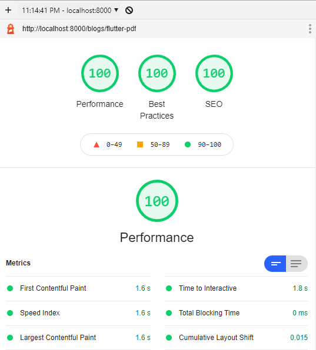
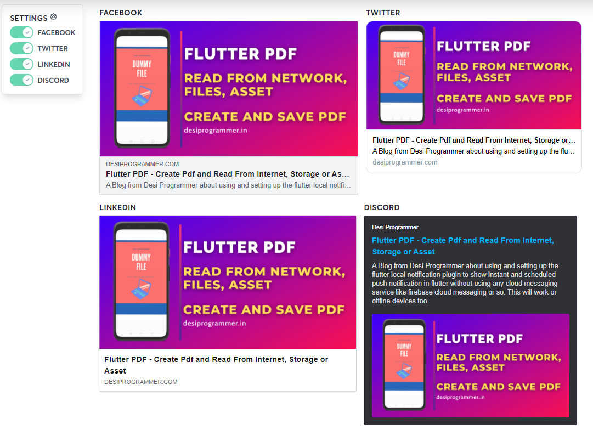

# Node JS, Markdown Blog Rendering

A Node js based Markdown Blog renderer or in Simple terms a static Site Generator.
Gives you a complete control of your backend and you can use it or deploy it wherever you want. Also it gives almost 100 on Google's Lighthouse for Seo, performance and Responsiveness.

# Contents
## [Performance](#performance)
## [How to use](#how-to-use)

# Performace

# Blog Rendering Time

## Light House Performance ( on desktop )


## Light House Performance ( on mobile )



### Note : The Blog used is [Flutter Pdf](content/flutter-pdf.md)
---
## OG and Meta Tags Preview 

#### Useful when you share you content 

#### Checked at [opengraph](https://www.opengraph.xyz/)



### Note : The Blog used is [Flutter Pdf](content/flutter-pdf.md)

# How to Use

Clone the repository

```bash
git clone https://github.com/desi-programmer/nodejs-blog-renderer
```

Create a new Blog

```bash
npm run create
```
Run the Server

```bash
npm start
```


# Dependencies
    - **gray-matter** to get all the blog information from the md file
    - **markdown-it** to parse the blog content into Html.
    - **markdown-it-attrs** to add attributes to our Html rendered

# Content
    - The entire content resides in content directory
    - A list of all the Blogs is stored in ... ( still thinking where ? )
    - For each blog there is a single MD file
    - To store assets and images , we use the static folder. ( a sub-directory named blogassets )

# SEO
    - All useful and related SEO tags are added already, you just need to provide values in the blog file
    - Ready to in-corrporate with Google bot, Bing Bot, OG , Twitter tags and Normal Meta Tags.

# Nav, Header and Footer
    - Available in seperate files under the partials
        - to use themes, may put a seperate nav for blogs ( as I don't plan to code entire website in both themes )
